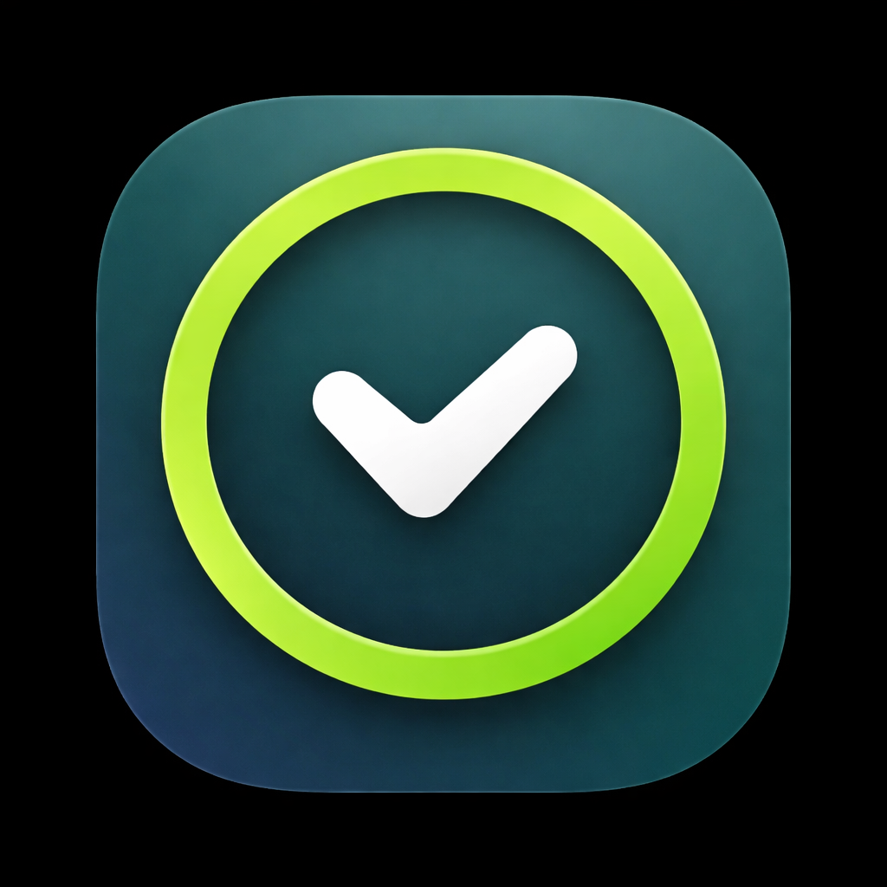

# Limit Watch

<p align="center">
  
</p>

`Limit Watch` is a watchOS app for viewing current `Codex` and `Claude Code` usage from an Apple Watch.

The repo has two parts:

- `limitWatch/LimitWatch`: the watchOS app
- `server`: a local Node.js helper server running on your Mac

The watch app talks to the local server over your LAN. The server reads local Codex session logs, optionally fetches Claude usage, and returns a normalized JSON response for the watch app.

## Features

- `Codex` usage from local Codex session logs in `~/.codex/sessions`
- `Claude` usage from Anthropic's Claude Code usage endpoint
- Current rate-limit windows when they are present in the source data
- On-device server configuration instead of hardcoded host values

## Requirements

- macOS with Xcode installed
- A paired `iPhone` and `Apple Watch`
- Your `Mac`, `iPhone`, and `Apple Watch` on the same Wi-Fi network
- Node.js `20.6+`

## Quick Start

1. Start the local server from the repository root:

```bash
cd server
cp .env.example .env
npm install
npm start
```

Your local `.env` should contain at least:

```env
HOST=0.0.0.0
PORT=8787
CLAUDE_USAGE_URL=https://api.anthropic.com/api/oauth/usage
```

For Claude support, provide one of:

- `CLAUDE_CODE_OAUTH_TOKEN`
- `CLAUDE_CODE_AUTH_HEADER`
- `CLAUDE_CODE_COOKIE`

2. Find your Mac's local IP:

```bash
ipconfig getifaddr en0
```

If `en0` returns nothing, try:

```bash
ipconfig getifaddr en1
```

3. Open `limitWatch/LimitWatch/LimitWatch.xcodeproj` in Xcode.
4. Choose your own signing team if Xcode prompts for one.
5. Install the app on a paired iPhone + Apple Watch.
6. In the watch app, open the settings screen, enter your Mac's LAN IP, and tap `Test Server`.

## How It Works

- The server reads Codex usage from `~/.codex/sessions`
- The server optionally fetches Claude usage from Anthropic
- The server exposes local endpoints on port `8787`
- The watch app requests those endpoints and renders the returned usage data

The server should listen on:

```text
http://0.0.0.0:8787
```

The watch should connect to your Mac's LAN IP, for example:

```text
http://192.168.1.10:8787
```

## Local API

The local server exposes:

```text
GET http://127.0.0.1:8787/health
GET http://127.0.0.1:8787/usage?provider=codex&startDate=2026-03-20
GET http://127.0.0.1:8787/usage?provider=claude
```

For `codex`, the app uses `startDate=YYYY-MM-DD`. The server also accepts `days=N` as a fallback query parameter.

## Troubleshooting

### The watch times out

Check all of the following:

- the server is running with `npm start`
- the server startup log says `http://0.0.0.0:8787`, not `127.0.0.1:8787`
- the watch app is pointed at your Mac's actual LAN IP
- your Mac, iPhone, and Watch are on the same Wi-Fi
- macOS firewall is not blocking incoming connections to Node or Terminal

Test from the Mac:

```bash
curl http://127.0.0.1:8787/health
curl http://YOUR_MAC_IP:8787/health
```

Both should return:

```json
{
  "ok": true
}
```

### Port `8787` is already in use

```bash
lsof -nP -iTCP:8787 -sTCP:LISTEN
kill <PID>
```

### Claude shows no data

Check that `.env` contains one of:

- `CLAUDE_CODE_OAUTH_TOKEN`
- `CLAUDE_CODE_AUTH_HEADER`
- `CLAUDE_CODE_COOKIE`

Then restart the server.

